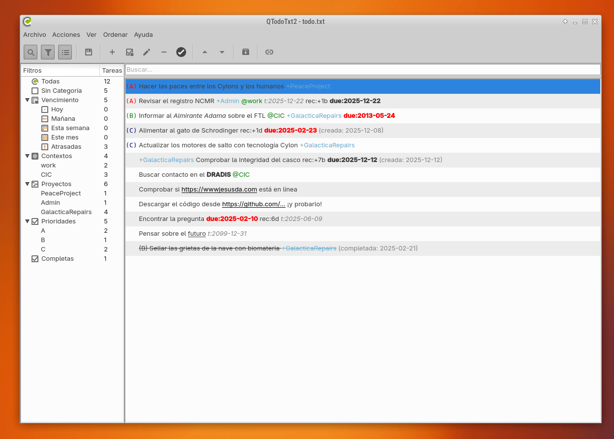
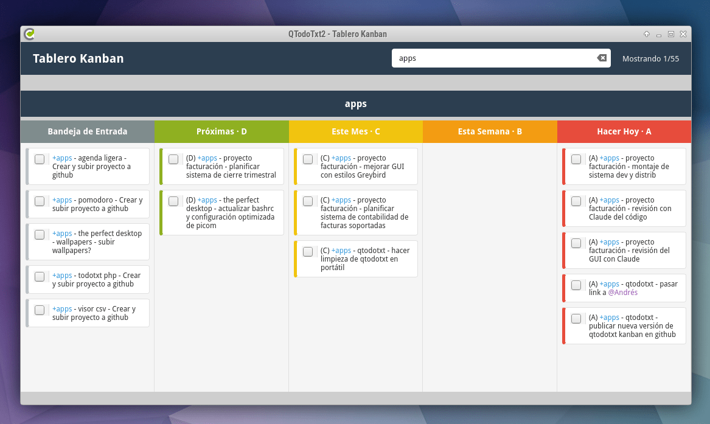
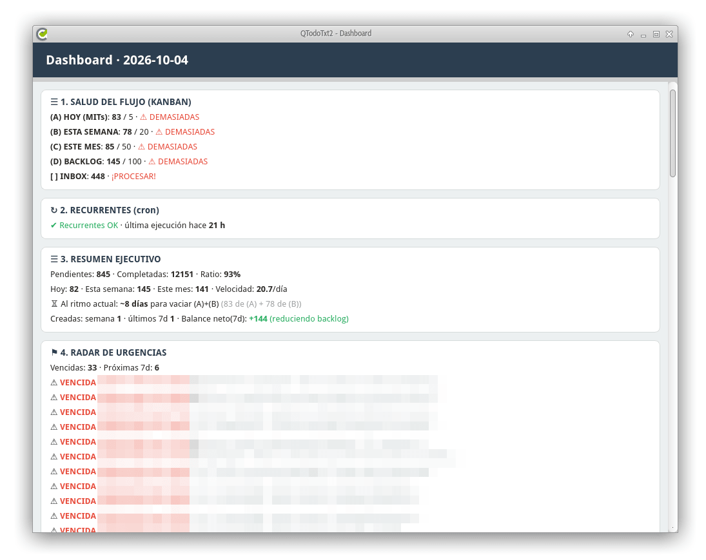

# QTODOTXT2-ES

Fork de [QTODOTXT2](https://github.com/QTodoTxt/QTodoTxt2/) traducido al español y con algunas mejoras y correcciones de errores.

## QUÉ ES QTDOTXT2-ES

**QTODOTXT2-ES es una aplicación gráfica para manejar archivos de tareas todo.txt usados por el método de gestión de tareas del mismo nombre.**

Puedes ver más información sobre el [método todo.txt](http://todotxt.org/) en su web.

La razón para hacerlo es porque es una aplicación que uso a diario desde hace años y está ya sin mantenimiento, con lo que tenía algunos errores y cambios que quería hacer... y lo hice. ;)

## CAMBIOS RESPECTO AL ORIGINAL

- **Versión en español** (intenté hacerlo con el módulo de traducción QML pero no hubo forma, así que la aplicación está traducida directamente en el código. Si te interesa la versión en tu idioma... ya sabes...)
- **Cambio completo de iconos** usando los iconos del proyecto Papirus (en su versión e-Papirus)
- Ahora los **iconos son en formato Vectorial SVG**, con lo que se ven mejor.
- **Solucionado problema con inserción de fechas** al añadir a una tarea fecha de vencimiento con due: (ahora las fechas se añaden sin error)
- **Detección y autorecarga de tareas cuando el archivo todo.txt es modificado** desde otra aplicación. Antes, cuando se modificaba el archivo todo.txt desde fuera de QtodoTXT2, se mostraba una ventana de confirmación, lo cual era bastante molesto si, como yo, usas todo.txt por línea de comandos al mismo tiempo que con QtodoTXT2.
- **Muestra en el panel de filtros de las tareas por fecha de vencimiento**. En la versión original sólo se mostraban los filtros de vencimiento si había alguna tarea que venciera en alguno de los plazos prefijados.
- Algunas mejoras y correcciones menores adicionales.
- **Mejora de rendimento** y resolución de problemas de bloqueos en hilos.
- **Actualización del código** para evitar problemas con versiones modernas de python3.
- **Panel Kanban** para gestión de progreso de proyectos (ver sección siguiente).
- **Panel Dashboard** con 17 bloques de información estratégica sobre tus tareas (ver sección siguiente).

### PANEL KANBAN

En las últimas versiones he añadido una opción de vista en panel **KANBAN**. Esta vista permite planificar mejor cada proyecto, al ver todas sus tareas por columnas.

En concreto, y para entender mejor la forma de usarlo, has de tener en cuenta que cada prioridad se asocia con un **estado** de la tarea respecto a **cuándo** se tiene previsto hacer.

Así, las prioridades se interpretarían como:

* **Sin prioridad**: Tareas **sin planificar**, en bandeja de entrada.
* **D**: Tareas que deseamos hacer **próximamente**.
* **C**: Tareas que hemos previsto realizar **a lo largo del presente mes**.
* **B**: Tareas que tenemos previsto hacer **durante esta semana**.
* **A**: Tareas a realizar **hoy**.

La ventaja de este tipo de planificación es que nos permite hacer revisiones periódicas y planificar las próximas acciones.

Además, el trablero Kanban se abre en una ventana adicional, lo que nos permite seguir trabajando con la lista de tareas en formato habitual.

Las tareas en el tablero Kanban se pueden **marcar como hechas** o **arrastrar de una columna a otra (drag and drop)** para cambiar su prioridad y así facilitar la planificación.
Además, el tablero Kanban, inicialmente muestra todas las tareas agrupadas por proyectos, lo que *es genial para evaluar el progreso de cada uno de ellos*, y también permite **filtrar** por nombre de proyecto, para enfocarnos mejor en cada uno de ellos.

### PANEL DASHBOARD

En la misma línea que el panel Kanban he añadido un **panel DASHBOARD** (el botón de la barra de herramientas, junto al de Kanban) que se abre en una ventana adicional y muestra una **visión estratégica de todo el sistema de tareas** en 17 bloques:

1. **Salud del flujo (Kanban)** — conteos por prioridad (A/B/C/D + inbox) con límites y avisos de sobrecarga.
2. **Recurrentes (cron)** — salud del cron que genera las tareas recurrentes.
3. **Resumen ejecutivo** — pendientes, completadas, ratio, velocidad, balance neto.
4. **Radar de urgencias** — tareas vencidas y próximas a vencer (7 días), agrupadas por proyecto.
5. **Foco actual** — top 5 proyectos activos en (A)/(B), proyectos dormidos, dispersión y recomendación de concentración.
6. **Progreso 7 días** — completadas por día, creadas hoy y tendencia semanal.
7. **@waiting delegadas** — tareas esperando a terceros, envejecimiento (+7d/+30d).
8. **Alertas de riesgo** — sobrecarga de (A), tareas sin fecha, inbox alto, proyectos estancados, caídas de productividad...
9. **Antigüedad** — tareas con edad 30/60/90 días y más antiguas.
10. **Contextos activos** — top 5 contextos con pendientes y vencidas.
11. **Balance entrada/salida** — histórico de 4 semanas y estimación de vaciado del backlog.
12. **Quick wins** — proyectos que se pueden cerrar rápido (>75% completado y ≤3 pendientes).
13. **Cuellos de botella** — proyectos bloqueados por tareas @waiting.
14. **Estado del sistema** — @waiting, @incubadora, zombies (D) antiguos, huérfanas.
15. **Salud del sistema** — puntuación global /100 con las penalizaciones listadas.
16. **Logros** — tareas de hoy, racha consecutiva y próximos hitos.
17. **Consejo ZTD** — consejo según el estado del sistema, de crisis a flujo zen, más un tip rotatorio.

El panel es de **solo lectura** (jamás escribe en tus ficheros) y los datos se refrescan automáticamente cada 30 segundos mientras la ventana está visible. La cabecera de cada bloque y sus fórmulas son idénticas a las de la versión de línea de comandos (`todo.sh dashboard`) y a las de mi versión web, de modo que los tres muestran siempre los mismos números.

A su vez, QtodoTXT2 es un fork de QtodoTXT, que es el original.

**Diferencias principales con QTodoTxt 1:**
*   Es una reescritura de la GUI de QTodoTxt usando QML
*   Código mucho más limpio, empaquetado más simple.
*   Widget de calendario para `due:` y `t:`.
*   Soporte para tareas ocultas: `h:1`.
*   Eliminación del soporte para algunas opciones y tecnologías heredadas como la bandeja del sistema (systray).

## INSTALACIÓN

### Métodos mejorados

He desarrollado e incorporado al proyecto una serie de scripts para facilitar la instalación y desinstalación del programa:

* build-deb.sh
	* Crea un paquete .deb para su instalación mediante apt/dpkg en distros Debian y derivadas.
	
* install-env.sh
	* Script de instalación que regenera un entorno python con todo lo necesario para que la aplicación funcione sin interferir en la instalación python del sistema. Es el sistema más seguro y que mejor garantiza el funcionamiento de la aplicación con independencia de la distro en la que se ejecute.
	* Además añade la aplicación al menú de aplicaciones y al path.
	* La aplicación se instala en /opt/todotxt-es
	* Requiere ejecutarse con sudo o como root.
	
* install-sys.sh
	* Script que instala la aplicación usando el entorno y librerías del sistema donde se instale.
	* Es la que menos ocupa ya que sólo usa las librerías del entorno, aunque puede requerir la instalación de ciertos paquetes en el sistema.
	* Además añade la aplicación al menú de aplicaciones y al path.
	* La aplicación se instala en /opt/todotxt-es
	* Requiere ejecutarse con sudo o como root.

* uninstall.sh
	* Script de desinstalación de la aplicación, si ésta ha sido instalada con install-env.sh o install-sys.sh.
	* Requiere ejecutarse con sudo o como root.

### Método manual

Basta con 

**En Debian, Ubuntu y derivadas:**

1.  `sudo apt install python3-pyqt5 python3-pyqt5.qtquick qml-module-qt-labs-folderlistmodel qml-module-qt-labs-settings qml-module-qtqml qml-module-qtqml-models2 qml-module-qtquick2 qml-module-qtquick-controls qml-module-qtquick-controls2 qml-module-qtquick-controls2 qml-module-qtquick-dialogs qml-module-qtquick-layouts qml-module-qtquick-window2`

2.  Descarga el código fuente de QTodoTxt2-es y descomprímelo en la ubicación que prefieras.

3.  Navega al subdirectorio 'bin' de QTodoTxt2-es y ejecuta el archivo 'qtodotxt'.

4.  Una vez iniciado QToDoTxt2, abre/selecciona tu archivo todo.txt y listo.

5. También puedes lanzarlo pasándole por parámetro la ruta a tu archivo todo.txt. ;)

**En Windows (no probado por mí):**

1.  Descarga el archivo: WinPython 3.5.3.1Qt5-64bit (*) o la versión de 32 bits en (http://winpython.github.io/)

2.  He descubierto que es mejor instalar esto fuera del directorio raíz (ej.: c:\winpython), no en Archivos de Programa o similar (parece que da problemas ahí).

3.  Regístralo ejecutando `winpython control panel.exe`. Selecciona 'Avanzado' y luego 'Registrar distribución'.

4.  Descarga el código fuente de QTodoTxt2 y descomprímelo en la ubicación que prefieras.

5.  Navega al subdirectorio 'bin' de QTodoTxt2 y ejecuta el archivo 'qtodotxt.pyw'.

6.  Una vez iniciado QToDoTxt2, abre/selecciona tu archivo todo.txt y listo.

---

jEsuSdA 8)