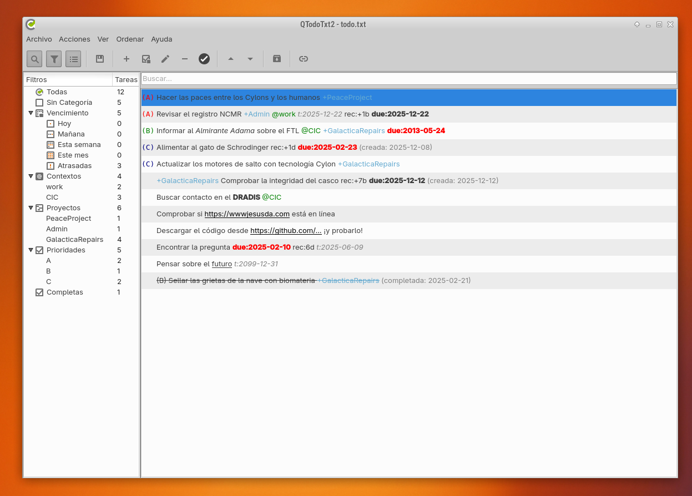

# QTODOTXT2-ES

Fork de [QTODOTXT2](https://github.com/QTodoTxt/QTodoTxt2/) traducido al español y con algunas mejoras y correcciones de errores.

## QUÉ ES QTDOTXT2-ES

**QTODOTXT2-ES es una aplicación gráfica para manejar archivos de tareas todo.txt usados por el método de gestión de tareas del mismo nombre.**

Puedes ver más información sobre el [método todo.txt](http://todotxt.org/) en su web.

La razón para hacerlo es porque es una aplicación que uso a diario desde hace años y está ya sin mantenimiento, con lo que tenía algunos errores y cambios que quería hacer... y lo hice. ;)

## CAMBIOS RESPECTO AL ORIGINAL

- **Versión en español** (intenté hacerlo con el módulo de traducción QML pero no hubo forma, así que la aplicación está traducida directamente en el código. Si te interesa la versión en tu idioma... ya sabes...)
- **Cambio completo de iconos** usando los iconos del proyecto [Papirus](https://github.com/PapirusDevelopmentTeam/papirus-icon-theme) (en su versión e-Papirus)
- Ahora los **iconos son en formato Vectorial SVG**, con lo que se ven mejor.
- **Solucionado problema con inserción de fechas** al añadir a una tarea fecha de vencimiento con due: (ahora las fechas se añaden sin error)
- **Detección y autorecarga de tareas cuando el archivo todo.txt es modificado** desde otra aplicación. Antes, cuando se modificaba el archivo todo.txt desde fuera de QtodoTXT2, se mostraba una ventana de confirmación, lo cual era bastante molesto si, como yo, usas todo.txt por línea de comandos al mismo tiempo que con QtodoTXT2.
- **Muestra en el panel de filtros de las tareas por fecha de vencimiento**. En la versión original sólo se mostraban los filtros de vencimiento si había alguna tarea que venciera en alguno de los plazos prefijados.
- Algunas mejoras y correcciones menores adicionales.

A su vez, QtodoTXT2 es un fork de QtodoTXT, que es el original.

**Diferencias principales con QTodoTxt 1:**
*   Es una reescritura de la GUI de QTodoTxt usando QML
*   Código mucho más limpio, empaquetado más simple.
*   Widget de calendario para `due:` y `t:`.
*   Soporte para tareas ocultas: `h:1`.
*   Eliminación del soporte para algunas opciones y tecnologías heredadas como la bandeja del sistema (systray).

## INSTALACIÓN

Basta con 

**En Debian, Ubuntu y derivadas:**

1.  `sudo apt install python3-pyqt5 python3-pyqt5.qtquick qml-module-qt-labs-folderlistmodel qml-module-qt-labs-settings qml-module-qtqml qml-module-qtqml-models2 qml-module-qtquick2 qml-module-qtquick-controls qml-module-qtquick-controls2 qml-module-qtquick-controls2 qml-module-qtquick-dialogs qml-module-qtquick-layouts qml-module-qtquick-window2`

2.  Descarga el código fuente de QTodoTxt2-es y descomprímelo en la ubicación que prefieras.

3.  Navega al subdirectorio 'bin' de QTodoTxt2-es y ejecuta el archivo 'qtodotxt'.

4.  Una vez iniciado QToDoTxt2, abre/selecciona tu archivo todo.txt y listo.

5. También puedes lanzarlo pasándole por parámetro la ruta a tu archivo todo.txt. ;)

**En Windows (no probado por mí):**

1.  Descarga el archivo: WinPython 3.5.3.1Qt5-64bit (*) o la versión de 32 bits en (http://winpython.github.io/)

2.  He descubierto que es mejor instalar esto fuera del directorio raíz (ej.: c:\winpython), no en Archivos de Programa o similar (parece que da problemas ahí).

3.  Regístralo ejecutando `winpython control panel.exe`. Selecciona 'Avanzado' y luego 'Registrar distribución'.

4.  Descarga el código fuente de QTodoTxt2 y descomprímelo en la ubicación que prefieras.

5.  Navega al subdirectorio 'bin' de QTodoTxt2 y ejecuta el archivo 'qtodotxt.pyw'.

6.  Una vez iniciado QToDoTxt2, abre/selecciona tu archivo todo.txt y listo.

---

jEsuSdA 8)
